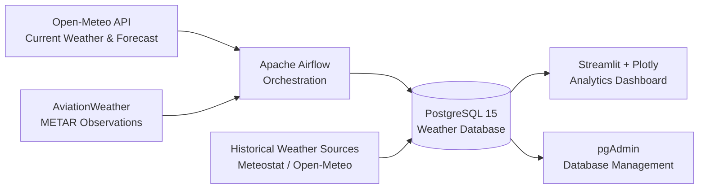
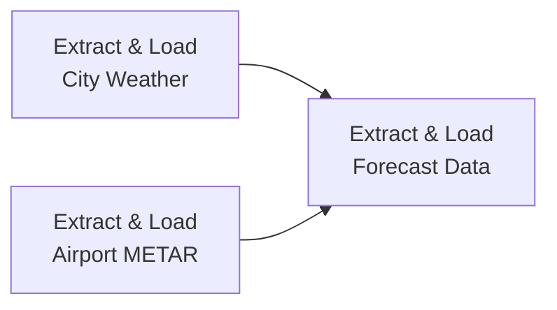
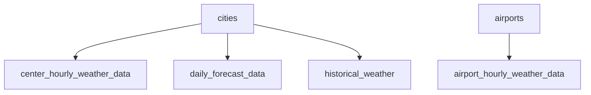
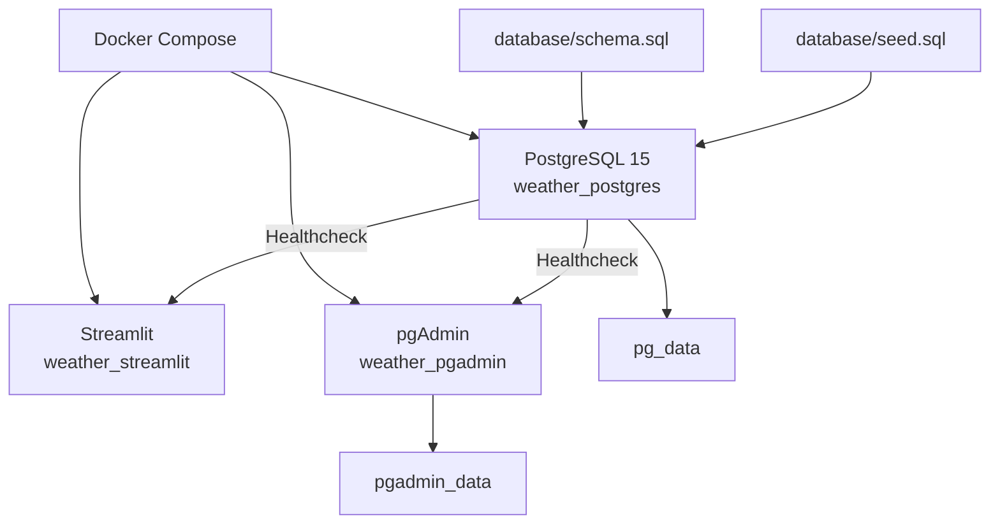
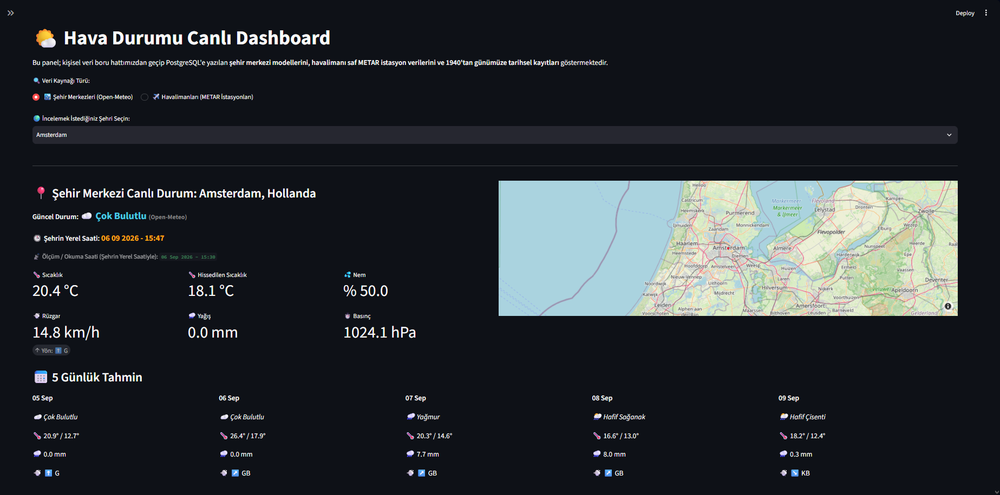
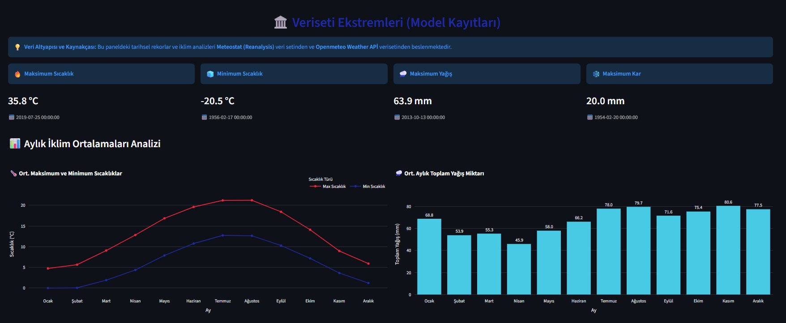
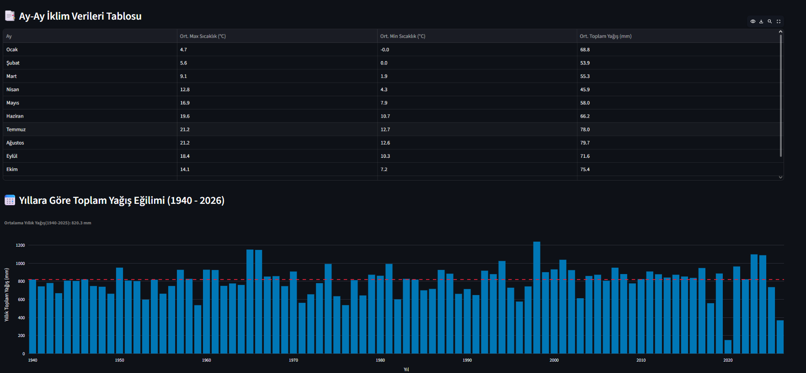
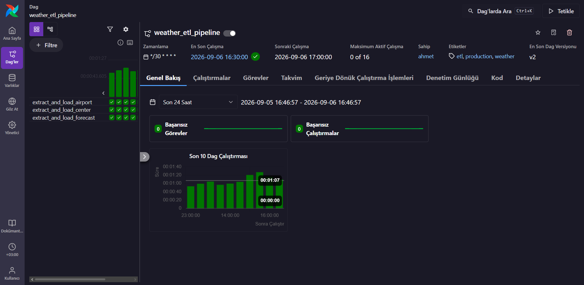

# 🌦️ Weather Data Engineering Platform

An end-to-end **Data Engineering project** for collecting, orchestrating, storing, processing and visualizing near-real-time and historical weather data from multiple sources.

The platform combines city-level weather observations, airport METAR reports, multi-day weather forecasts and historical climate datasets inside a reproducible local data infrastructure built with **Python, PostgreSQL, Apache Airflow, Docker, Streamlit and Plotly**.

> This project is actively evolving. Apache Spark and additional data engineering components will be integrated in the next stage of the project.

---

## 📌 Project Overview

The goal of this project is not only to display weather information, but to build a practical end-to-end data engineering environment around weather and climate data.

The platform currently supports:

- Near-real-time city weather ingestion
- Airport METAR observation ingestion
- Multi-day weather forecasts
- Historical climate data ingestion
- Multi-source ETL workflows
- Apache Airflow orchestration
- PostgreSQL relational storage
- Idempotent inserts and UPSERT operations
- Dockerized local infrastructure
- Automatic database schema initialization
- Persistent PostgreSQL and pgAdmin volumes
- Interactive Streamlit & Plotly analytics
- Logging
- Retry mechanisms
- API request caching
- Environment-based configuration

The project currently tracks **27 cities and 27 airports** through its reference tables.

---

## 🏗️ System Architecture



The architecture intentionally separates the main responsibilities of the system:

```text
Apache Airflow  →  Orchestration
PostgreSQL      →  Data Storage
Streamlit       →  Analytics & Presentation
pgAdmin         →  Database Administration
```

---

## 🔄 Apache Airflow Pipeline

Apache Airflow orchestrates the automated near-real-time ingestion workflow.

The main DAG is:

```text
weather_etl_pipeline
```

The pipeline is scheduled to run every **30 minutes**.



The city-center and airport ingestion tasks execute independently.

After both upstream tasks finish successfully, the forecast task begins.

The DAG includes:

- Automatic retries
- Retry delays
- Structured logging
- Task dependency management
- `catchup=False`
- Production-oriented DAG tags
- Separate extraction and loading functions

---

## 🗄️ Application Database vs Airflow Metadata Database

The local environment contains **two logically separate PostgreSQL databases** with different responsibilities.

| Database | Purpose |
|---|---|
| PostgreSQL 15 | Stores weather observations, forecasts, city metadata, airport metadata and historical climate records |
| Airflow Metadata PostgreSQL | Stores DAG runs, task instances, scheduler state and internal Airflow metadata |

Airflow **does not store the weather datasets in its metadata database**.

Instead, Airflow DAG tasks execute Python ingestion functions which connect to the main Weather PostgreSQL database.

Current local communication flow:

```text
Airflow Container
       │
       │ host.docker.internal:5432
       ▼
Weather PostgreSQL 15
```

This allows the Astro-managed Airflow environment and the main Docker Compose application stack to remain independent while still communicating with each other.

---

## 🌐 Data Sources

### Open-Meteo

Open-Meteo is used for city-level weather observations and forecast data.

Collected information includes:

- Temperature
- Apparent temperature
- Relative humidity
- Precipitation
- Rain
- Snowfall
- Cloud cover
- Sea-level pressure
- Wind speed
- Wind direction
- Weather codes
- Forecast data

API requests use caching and retry mechanisms to reduce unnecessary requests and improve pipeline reliability.

---

### Aviation Weather / METAR

Airport observations are retrieved using ICAO station codes from METAR-compatible aviation weather services.

Collected information includes:

- Temperature
- Dew point
- Relative humidity
- Wind speed
- Wind direction
- Atmospheric pressure
- Precipitation
- Airport weather observations

This allows the platform to compare city-center weather observations with real airport station measurements.

---

### Historical Weather Data

Historical weather ingestion uses historical weather providers such as:

- Meteostat
- Open-Meteo historical datasets

depending on location and source availability.

Historical data is available across long time ranges for supported locations, with some datasets extending back to **1940**.

The historical ETL pipeline performs extraction, normalization, basic validation and cleaning before loading records into PostgreSQL.

---

## 🧱 Database Model

The main application database currently contains six core tables:

```text
cities
airports

center_hourly_weather_data
airport_hourly_weather_data
daily_forecast_data
historical_weather
```

Main logical relationships:



Reference metadata is stored separately from observation data.

This makes the schema easier to maintain and extend as new cities, airports and weather datasets are introduced.

---

## 🛡️ Idempotency & Data Consistency

The near-real-time ingestion layer uses relational constraints and conflict handling to prevent duplicate records.

City observations use:

```sql
UNIQUE (city_id, record_time)
```

Airport observations use:

```sql
UNIQUE (airport_id, record_time)
```

Forecast records use:

```sql
UNIQUE (city_id, forecast_date)
```

Current observation ingestion uses:

```sql
ON CONFLICT DO NOTHING
```

while forecast ingestion uses UPSERT-style behavior:

```sql
ON CONFLICT (...)
DO UPDATE
```

This allows Airflow tasks to be retried without unnecessarily creating duplicate records.

> Historical ingestion idempotency is planned as an upcoming improvement.

---

## 📚 Historical ETL Pipeline

Historical weather processing is currently separated from the near-real-time Airflow DAG.

The historical pipeline follows the general flow:

```text
Historical Weather Source
          ↓
Chunked Extraction
          ↓
Pandas DataFrames
          ↓
Type Normalization
          ↓
Sanity Checks
          ↓
Missing Value Handling
          ↓
Duplicate Date Removal
          ↓
PostgreSQL
```

Historical data is requested in smaller time windows rather than through a single extremely large request.

This provides several advantages:

- Better API reliability
- Easier rate-limit management
- Improved error recovery
- Lower memory pressure
- Easier debugging
- Better control over partial failures

Basic sanity checks are also applied before records are persisted.

---

## 🐳 Docker Architecture

The main application infrastructure is managed using Docker Compose.



The Streamlit application is built directly from the repository's `Dockerfile`.

PostgreSQL includes a healthcheck using:

```text
pg_isready
```

and dependent services wait until the database becomes healthy before starting.

---

## 🆕 Automatic Database Initialization

When PostgreSQL starts with a **fresh Docker volume**, the initialization scripts are automatically executed in order:

```text
database/schema.sql
        ↓
database/seed.sql
```

`schema.sql` contains the relational database structure including:

- Tables
- Sequences
- Primary keys
- Foreign keys
- Unique constraints

`seed.sql` initializes reference metadata for:

```text
27 cities
27 airports
```

Existing PostgreSQL volumes are not reinitialized, so accumulated weather data remains intact during normal container recreation or restart operations.

---

## 💾 Persistent Storage

Two Docker volumes are currently used:

```text
pg_data
    └── PostgreSQL application data

pgadmin_data
    └── pgAdmin configuration
```

Container recreation therefore does not automatically remove stored database data.

> Avoid using `docker compose down -v` unless you intentionally want to delete the Docker volumes and rebuild the database from scratch.

---

## 📊 Analytics Dashboard

The Streamlit dashboard reads data directly from PostgreSQL and provides interactive analytics using Plotly.

Current dashboard capabilities include:

- Global city map
- Current city weather
- Current airport METAR observations
- Multi-day forecasts
- Temperature analysis
- Precipitation analysis
- Wind analysis
- Historical climate exploration
- Monthly aggregations
- Yearly aggregations
- Long-term precipitation trends
- Airport weather analysis
- Interactive visualizations

---

### Dashboard Overview



---

### Historical Climate Analysis





---

### Apache Airflow DAG



---

## 🛠️ Technology Stack

| Category | Technologies |
|---|---|
| Language | Python |
| Orchestration | Apache Airflow |
| Airflow Runtime | Astronomer / Astro CLI |
| Database | PostgreSQL |
| Database Administration | pgAdmin |
| Containerization | Docker, Docker Compose |
| Data Processing | Pandas |
| Database Connectivity | psycopg2, SQLAlchemy |
| Dashboard | Streamlit |
| Visualization | Plotly |
| Weather APIs | Open-Meteo, AviationWeather, Meteostat |
| API Reliability | requests-cache, retry-requests |
| Configuration | python-dotenv |
| Version Control | Git, GitHub |

---

## 📂 Project Structure

```text
Weather-Data-Engineering-Platform/
│
├── airflow/
│   ├── .astro/
│   │   └── config.yaml
│   │
│   ├── dags/
│   │   ├── src/
│   │   │   ├── database.py
│   │   │   ├── extract.py
│   │   │   ├── load.py
│   │   │   └── logger.py
│   │   │
│   │   └── weather_pipeline_dag.py
│   │
│   ├── .env.example
│   ├── Dockerfile
│   ├── requirements.txt
│   ├── packages.txt
│   └── README.md
│
├── database/
│   ├── schema.sql
│   └── seed.sql
│
├── docs/
│   └── images/
│       ├── dashboard-overview.png
│       ├── historical-analysis.png
│       └── airflow-dag.png
│
├── history/
│   ├── config.py
│   ├── historical_etl.py
│   └── openm_rescue.py
│
├── scripts/
│   └── check_station_inventory.py
│
├── .dockerignore
├── .env.example
├── .gitignore
├── app.py
├── docker-compose.yml
├── Dockerfile
├── main.py
├── requirements.txt
└── README.md
```

---

## 🚀 Getting Started

### Prerequisites

Install:

- Git
- Docker Desktop
- Docker Compose
- Astronomer Astro CLI if you want to run Apache Airflow locally

---

### 1. Clone the Repository

```bash
git clone https://github.com/Avdatek5003/Weather_Data_Pipeline.git

cd Weather_Data_Pipeline
```

---

### 2. Configure Environment Variables

Copy:

```text
.env.example
```

to:

```text
.env
```

Linux / macOS:

```bash
cp .env.example .env
```

Windows PowerShell:

```powershell
Copy-Item .env.example .env
```

Then configure your local credentials.

Example:

```env
DB_HOST=localhost
DB_PORT=5432
DB_NAME=Weather_Data_Pipeline
DB_USER=postgres
DB_PASSWORD=your_password

RAPIDAPI_KEY=your_rapidapi_key

PGADMIN_DEFAULT_EMAIL=admin@example.com
PGADMIN_DEFAULT_PASSWORD=your_pgadmin_password
```

Never commit the real `.env` file.

---

## 🐳 Running the Main Application Stack

Build and start the application:

```bash
docker compose up -d --build
```

This starts:

```text
PostgreSQL → localhost:5432
pgAdmin    → localhost:5050
Streamlit  → localhost:8501
```

Open the Streamlit dashboard:

```text
http://localhost:8501
```

Open pgAdmin:

```text
http://localhost:5050
```

Check container status:

```bash
docker compose ps
```

The PostgreSQL service should report:

```text
healthy
```

---

## ⚙️ Running Apache Airflow

Apache Airflow is currently managed as a separate Astro project.

Move into the Airflow directory:

```bash
cd airflow
```

Copy the Airflow environment template.

Linux / macOS:

```bash
cp .env.example .env
```

Windows PowerShell:

```powershell
Copy-Item .env.example .env
```

The Airflow environment uses:

```env
DB_HOST=host.docker.internal
DB_PORT=5432
DB_NAME=Weather_Data_Pipeline
DB_USER=postgres
DB_PASSWORD=your_password
```

Start Airflow:

```bash
astro dev start
```

Open the Airflow UI:

```text
http://localhost:8080
```

The Airflow metadata database and the Weather application database are separate.

Airflow DAG containers reach the application PostgreSQL database through:

```text
host.docker.internal:5432
```

Stop the Astro environment with:

```bash
astro dev stop
```

---

## ▶️ Running Historical Ingestion

Historical ingestion can be executed separately from the near-real-time Airflow workflow.

From the project root:

```bash
python history/historical_etl.py
```

Required API credentials must be configured in `.env`.

---

## 🔐 Security & Configuration

Sensitive credentials are not intended to be committed to the repository.

The project uses environment variables for:

```text
Database username
Database password
Database host
Database port
Database name
RapidAPI key
pgAdmin credentials
```

Real credentials belong in `.env`.

The repository contains `.env.example` files only to document the required configuration.

---

## 🧠 Engineering Concepts Demonstrated

This project currently demonstrates practical implementations of:

- ETL pipeline design
- Multi-source data ingestion
- Workflow orchestration
- DAG design
- Task dependencies
- Retry strategies
- API caching
- Environment-based configuration
- Relational data modeling
- Primary keys
- Foreign keys
- Unique constraints
- SQL UPSERT operations
- Idempotent ingestion
- Docker containerization
- Docker Compose
- Service healthchecks
- Persistent Docker volumes
- Database initialization scripts
- Historical batch ingestion
- Time-series storage
- Structured logging
- Data cleaning
- Data validation
- Interactive analytics

---

## 🗺️ Roadmap

The project is still under active development.

- [x] Multi-source weather ingestion
- [x] Open-Meteo current weather ingestion
- [x] Airport METAR ingestion
- [x] Weather forecast ingestion
- [x] PostgreSQL relational model
- [x] Historical climate pipeline
- [x] Apache Airflow orchestration
- [x] Dockerized development environment
- [x] Automatic database initialization
- [x] Streamlit analytics dashboard
- [x] Persistent database infrastructure
- [ ] Historical pipeline idempotency improvements
- [ ] Apache Spark processing layer
- [ ] Automated data quality validation
- [ ] Unit testing
- [ ] Integration testing
- [ ] CI/CD with GitHub Actions
- [ ] Cloud deployment

---

## 🔭 Next Stage: Apache Spark

Apache Spark is intentionally listed as a **future component rather than a currently implemented technology**.

The next stage of the project will introduce Spark after an appropriate processing use case has been designed for the growing historical weather datasets.

The goal is to use Spark for meaningful distributed data processing rather than adding it only as a portfolio technology.

Possible Spark responsibilities include:

```text
Historical Weather Data
        ↓
Apache Spark
        ↓
Distributed Transformations
        ↓
Aggregated / Curated Layer
        ↓
Analytics Storage
        ↓
Streamlit
```

This will allow the architecture to evolve from a traditional Python/PostgreSQL ETL pipeline toward a more scalable data-processing platform.

---

## 📈 Project Status

The core ingestion, storage, orchestration, containerization and visualization layers are operational.

Current development path:

```text
Apache Spark Fundamentals
          ↓
Spark Integration
          ↓
Historical Pipeline Improvements
          ↓
Data Quality
          ↓
Testing
          ↓
CI/CD
          ↓
Project Completion
```

---

## 👤 Author

**Ahmet Avdatek**

Computer Engineering student focused on **Data Engineering, distributed data systems and cloud data platforms**.